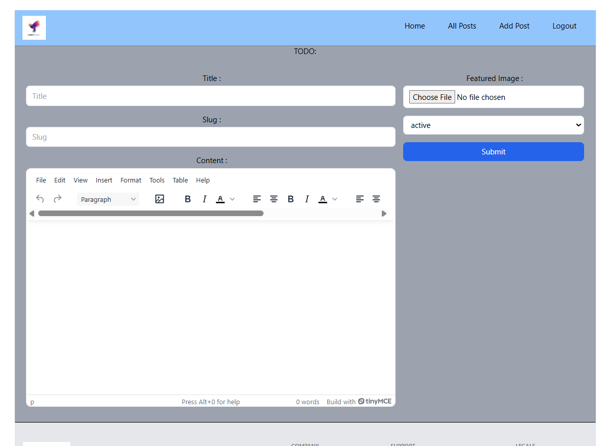
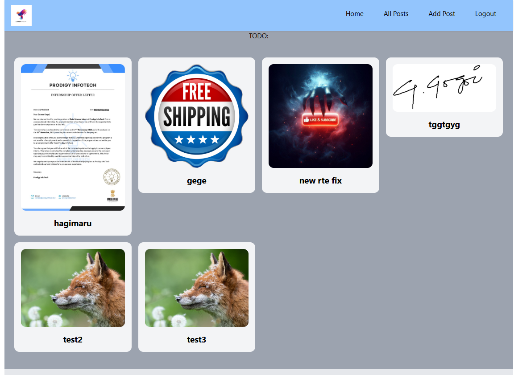

# 📝 MegaBlog – Full-Stack Blog Application

MegaBlog is a **full-featured blog platform** built using **React**, **Appwrite**, **Redux**, and **Tailwind CSS**. It allows users to **create**, **edit**, **delete**, and **view** blog posts with a clean, responsive UI. It uses **SEO-friendly slugs**, **rich text editing** via **TinyMCE**, and maintains a centralized state using **Redux Toolkit**.

---

## 🚀 Live Demo

🌐 [Click here to try MegaBlog](https://megablog-peach.vercel.app/)

---

## 🛠️ Tech Stack

| Category         | Tools/Tech Used                      |
|------------------|--------------------------------------|
| Frontend         | React, React Router, Tailwind CSS    |
| Backend (BaaS)   | Appwrite (Self-hosted / Cloud)       |
| State Management | Redux Toolkit                        |
| Forms            | React Hook Form                      |
| Editor           | TinyMCE (Rich Text Editor)           |
| Routing          | React Router DOM                     |
| Deployment       | Vercel (Frontend), Render/Appwrite   |
| Dev Utilities    | Forward Refs, Form Validation, Slugify|

---

## ✨ Features

- 🔐 **Auth Integration** (Login, Signup via Appwrite)
- 🖊️ **Create / Edit / Delete Blog Posts**
- 📃 **Rich Text Editor** using TinyMCE
- 🏷️ **SEO-Friendly Slugs**
- 🔄 **Single Layout via ForwardRef** for consistent structure
- 🎯 **Redux Store** for clean state management
- 🎨 **Tailwind CSS UI** – Fast, mobile-first, and fully responsive
- 📁 Centralized config and service structure
- 💡 Fully functional as a portfolio-grade full stack project

---

## 📸 Screenshots

| Create Post | Blog Feed |
|-------------|-----------|
|  |  |

---

